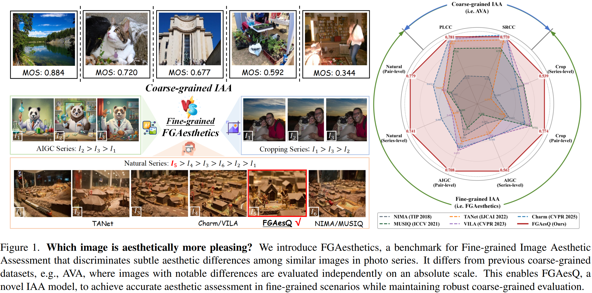

<div align="center">
    <a href="https://arxiv.org/abs/2603.03907"></a>
    <a href="https://yzc-ippl.github.io/FG-IAA/"></a>
    <a href='https://github.com/yzc-ippl/FG-IAA/stargazers'></a>
</div>

<h1 align="center">Fine-grained Image Aesthetic Assessment: Learning Discriminative Scores from Relative Ranks</h1>

<div align="center">
    Zhichao Yang<sup>1†</sup>,
    Jianjie Wang<sup>1†</sup>,
    Zhixianhe Zhang<sup>1</sup>,
    Pangu Xie<sup>1</sup>,
    Xiangfei Sheng<sup>1</sup>,
    Pengfei Chen<sup>1</sup>,
    Leida Li<sup>1,2*</sup>
</div>

<div align="center">
  <sup>1</sup>School of Artificial Intelligence,
  <sup>2</sup>State Key Laboratory of EMIM, Xidian University
</div>

<div align="center">
<sup>†</sup>Equal contribution &nbsp;&nbsp; <sup>*</sup>Corresponding author
</div>

<br>

<div align="center">
  
</div>

<div style="font-family: sans-serif; margin-bottom: 2em;">
    <h2 style="border-bottom: 1px solid #eaecef; padding-bottom: 0.3em; margin-bottom: 1em;">News</h2>
    <ul style="list-style-type: none; padding-left: 0;">
        <li style="margin-bottom: 0.8em;">
            <strong>[2026-04-10]</strong> ✨</span>✨</span> The <strong>Inference Code</strong> and <strong>Pre-trained Weights</strong>, are now publicly available. A demo video demonstrating FGAesQ's application in <strong>LivePhoto Cover Recommendation</strong> is also provided.
        </li>
        <li style="margin-bottom: 0.8em;">
            <strong> [2026-04-09]</strong> 🎉</span>🎉</span> Congratulations! Our paper has been accepted for an <strong>Oral Presentation</strong> at CVPR 2026.
        </li>
        <li style="margin-bottom: 0.8em;">
            <strong>[2026-02-21]</strong> 🎉</span>🎉</span>  Our paper, "Fine-grained Image Aesthetic Assessment: Learning Discriminative Scores from Relative Ranks", has been accepted to <strong>CVPR 2026</strong>!
        </li>
    </ul>
</div>

## Applicatons (More scenarios will be uncovered)

<div align="center">
  <video src="https://github.com/yzc-ippl/FG-IAA/releases/download/v1.0/demo_2.mp4" width="900" controls></video>
</div>

## Quick Start

This guide will help you get started with FGAesQ inference in minutes.

### 1. Installation

Clone the repository and install the required dependencies:

```bash
git clone https://github.com/yzc-ippl/FG-IAA.git
cd FG-IAA
pip install -r requirements.txt
```

> **Note:** The CLIP dependency is installed directly from the official OpenAI repository and will be fetched automatically via `pip install -r requirements.txt`.

### 2. Download Pre-trained Weights

Download the pre-trained model weights from: [**(Hugging Face)**](https://huggingface.co/yzc002/FGAesQ) &nbsp;|&nbsp; [**(Baidu Netdisk)**](#)

Place the downloaded weight file at a path of your choice and set `MODEL_PATH` accordingly in the inference scripts.

The expected project structure is as follows:

```
FG-IAA/
 utils/
   ├── FGAesQ.py               # Model definition
   ├── DiffToken.py            # Differential token preprocessing
   ├── data_utils.py
   └── clip_vit_base_16_224.pt
 inference_series.py         # Series-mode inference
 inference_single.py         # Single-image inference
 requirements.txt
 README.md
```

### 3. Run Inference

FGAesQ supports two inference modes: **Series Mode** for photo series ranking, and **Single Mode** for individual image scoring.

---

#### 🖼️ Mode 1 — Single Image / Folder Scoring

Use `inference_single.py` to score a single image or all images within a folder.

**Configuration** (edit the `main()` function in `inference_single.py`):

```python
MODEL_PATH = "path/to/your/model.pt"   # Path to the pre-trained weights
INPUT_PATH = "path/to/image_or_folder" # Single image file or folder of images
OUTPUT_TXT = "path/to/output.txt"      # Output txt path (folder mode only; set None to auto-generate)
DEVICE     = "cuda"
BATCH_SIZE = 128
```

**Run:**

```bash
python inference_single.py
```

**Output format** (`single_result.txt`):

```
Total: 3
============================================================

  1. photo_A.jpg                                      0.872314
  2. photo_B.jpg                                      0.751203
  3. photo_C.jpg                                      0.634891
```

- **Single image**: the predicted aesthetic score is printed directly to the terminal.
- **Folder**: a ranked list of all images with scores is saved to `OUTPUT_TXT`.

---

#### 📂 Mode 2 — Photo Series Ranking

Use `inference_series.py` to rank images within multiple photo series simultaneously.

The input folder should contain one sub-folder per series, with image files named in the format `{series_id}-{index}.jpg` (e.g., `000009-01.jpg`, `000009-02.jpg`).

```
input_folder/
 000009/
   ├── 000009-01.jpg
   ├── 000009-02.jpg
   └── 000009-03.jpg
 000010/
   ├── 000010-01.jpg
   └── 000010-02.jpg
 ...
```

**Configuration** (edit the `main()` function in `inference_series.py`):

```python
MODEL_PATH    = "path/to/your/model.pt"   # Path to the pre-trained weights
INPUT_FOLDER  = "path/to/series_folder"   # Root folder containing all series sub-folders
OUTPUT_FOLDER = "path/to/series_result"   # Output directory for per-series result txt files
DEVICE        = "cuda:0"
BATCH_SIZE    = 64
MAX_SIZE      = 2048  # Max image resolution (long edge). Use None for no limit.
                      # Recommended: 2048 if many images exceed this resolution.
```

**Run:**

```bash
python inference_series.py
```

**Output format** (one `{series_id}_result.txt` per series in `OUTPUT_FOLDER`):

```
Series: 9
Count: 3
============================================================

Ranking: 000009-02.jpg  000009-01.jpg  000009-03.jpg

Scores:  0.8812  0.7654  0.6231

Order: 000009-02.jpg > 000009-01.jpg > 000009-03.jpg
```

Each output file contains the predicted ranking and aesthetic scores for all images in that series, sorted from best to worst.

---

## Citation

If you find this work useful, please cite our paper!

```bibtex
@article{yang2026fine,
  title={Fine-grained Image Aesthetic Assessment: Learning Discriminative Scores from Relative Ranks},
  author={Yang, Zhichao and Wang, Jianjie and Zhang, Zhixianhe and Xie, Pangu and Sheng, Xiangfei and Chen, Pengfei and Li, Leida},
  journal={arXiv preprint arXiv:2603.03907},
  year={2026}
}
```
